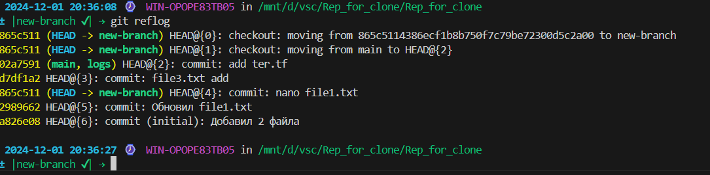

# Задание 

### Индивидуальная часть: На созданном аккаунте github.com создать репозиторий и клонировать его себе локально. Настроить себе доступы для того, чтобы можно было пушить изменения в ветки. Init commit может быть и локальный, это на ваше усмотрение. Далее реализовать следующие сценарии

1. Создать 5-10 коммитов. (Пример: создать файлы, поменять их содержимое). Вывести их лог экран, сделать скрин и добавить в отчёт.
   
2. С помощью reflog перейти к предыдущему коммиту (на ваше усмотрение). Output, screen, report. (Вывести их лог экран, сделать скрин и добавить в отчёт.) https://youtu.be/XRV9kai-3mc (небольшая помощь, если запутаетесь)
   
3. Создайте ветку с названием на ваше усмотрение (можно develop). OSR. (Output, screen, report.)
   
4. Создайте коммит и добавьте туда ещё дополнительные измения (добавьте, например в изменяемый файл точку, пробел и тд) с помощью ammend. OSR.
   
5. Сделайте коммит в main. Но не делайте git push (это важно!), сделайте изменения локально.
   
6. Сделайте так, чтобы этот коммит оказался в новой ветке с помощью git reset --hard. OSR
   
7. Сделайте изменения в файле локально. Сделайте коммит для этого изменения. OSR
   
8. Через git checkout отмените изменения в файле через откат по сохранённому хэшу. OSR
   
9.  Начните всё заново (это важно чтобы вы делали локально то, что я указал сделать локально). Можно использовать любой из подходов. OSR Ваш основной гайд: https://pikabu.ru/story/git_shit_10252570 Оформленный отчёт запушьте на ваш ПРИВАТНЫЙ репозиторий, куда вы меня уже добавили или добавите (кто этого ещё не сделал).

# Выполнение

## 1. 5 Коммитов

## 2. Reflog 
   
   

## 3. Branch "develop"
   
   

## 4. Commit + amend

## 5. Main commit

## 6. git reset -hard

## 7. Local commit

## 8. git checkout

