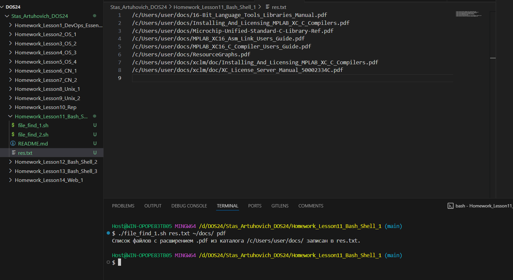
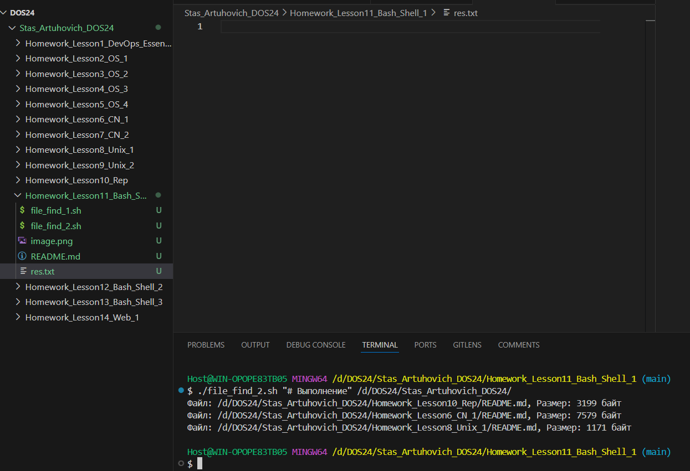

# Задание
1. Написать скрипт, выводящий в файл (имя файла задаётся
пользователем в качестве первого аргумента командной строки) имена
всех файлов с заданным расширением (третий аргумент командной
строки) из заданного каталога (имя каталога задаётся пользователем в
качестве второго аргумента командной строки).

2. Файлы сгенерировать мне самому *** Написать скрипт для поиска заданной пользователем строки во всех
файлах заданного каталога и всех его подкаталогах (строка и имя
каталога задаются пользователем в качестве первого и второго
аргумента командной строки). На консоль выводятся полный путь и
имена файлов, в содержимом которых присутствует заданная строка, и
их размер. Если к какому-либо каталогу нет доступа, необходимо
вывести соответствующее сообщение и продолжить выполнение

# Выполнение

## Задание 1.

Переход в нужную директорию
```bash
cd /d/DOS24/Stas_Artuhovich_DOS24/Homework_Lesson11_Bash_Shell_1
```
Создание файла ***file_find_1.sh***
```bash
touch file_find_1_sh.
```
Закидываем скрипт в него и запускаем:
```bash
./file_find_1.sh res.txt ~/docs/ pdf
```


## При вызове скрипта вводим 3 значения:
***rex.txt*** - место,куда будет записываться результат

***~/docs/*** - папка, в которой скрипт будет искать запрашиваемый файл

***pdf*** - расширение, которое ищет скрипт

## Задание 2.

Создание файла со скриптом
```bash
touch file_find_2.sh
```
Закидываем скрипт и запускаем
```bash
./file_find_2.sh "# Выполнение" /d/DOS24/Stas_Artuhovich_DOS24/
```


## При вызове скрипта вводи 2 значения:

***"# Выполнение"*** - строка, которую ищем 

***/d/DOS24/Stas_Artuhovich_DOS24/*** - директория, в которой ищем строку


