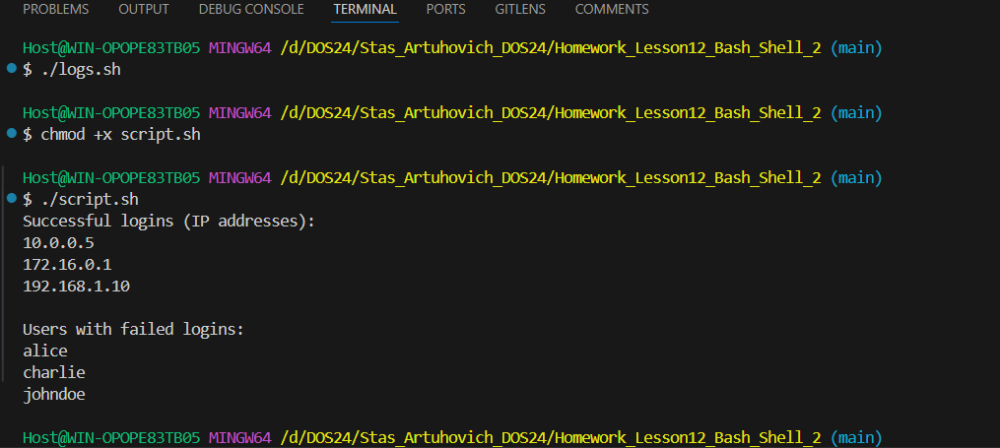

# Задание 
Описание задачи:
У вас есть лог-файл, имитирующий логи сервера.
Необходимо извлечь все IP-адреса, с которых произошел успешный вход (код ответа 200). Также извлечь все уникальные пользователи (usernames), которые пытались авторизоваться, но получили ошибку (код ответа 403).

2024-11-26 12:30:15 [INFO] user=johndoe ip=192.168.1.10 status=200
2024-11-26 12:31:03 [INFO] user=alice ip=10.0.0.5 status=403
2024-11-26 12:35:42 [INFO] user=bob ip=172.16.0.1 status=200
2024-11-26 12:36:00 [INFO] user=johndoe ip=192.168.1.10 status=403
2024-11-26 12:40:22 [INFO] user=charlie ip=10.0.0.8 status=403
2024-11-26 12:42:10 [INFO] user=alice ip=10.0.0.5 status=200

Инструкция к выполнению:
Скачайте лог-файл (или создайте его на основе примера выше).

Напишите Bash-скрипт, который:
Находит все IP-адреса с кодом статуса 200.
Находит всех уникальных пользователей, у которых был статус 403.
Пример вывода Bash-скрипта:

Successful logins (IP addresses):
192.168.1.10
172.16.0.1
10.0.0.5

Users with failed logins:
johndoe
alice
charlie

***Код генерации логов:***

#!/bin/bash 

#Генерация лог-файла

LOGFILE="server.log"

echo "2024-11-26 12:30:15 [INFO] user=johndoe ip=192.168.1.10 status=200" > $LOGFILE

echo "2024-11-26 12:31:03 [INFO] user=alice ip=10.0.0.5 status=403" >> $LOGFILE

echo "2024-11-26 12:35:42 [INFO] user=bob ip=172.16.0.1 status=200" >> $LOGFILE

echo "2024-11-26 12:36:00 [INFO] user=johndoe ip=192.168.1.10 status=403" >> $LOGFILE

echo "2024-11-26 12:40:22 [INFO] user=charlie ip=10.0.0.8 status=403" >> $LOGFILE

echo "2024-11-26 12:42:10 [INFO] user=alice ip=10.0.0.5 status=200" >> $LOGFILE

# Выполнение

Созданил файл с логом и закинул туда код генерации
```
touch logs.sh
```
Дал скрипту права на запуск. При запуске кода создался файл ***__server.log__***
```
chmod +x logs.sh
./logs.sh
```
Создал файл script.sh с bash-скриптом
```
touch script.sh
```
Создал bash-скрипт в файле ***script.sh*** 

Дал ему права на запуск и запустил его:

```
chmod +x script.shx 
./script.sh 
```

