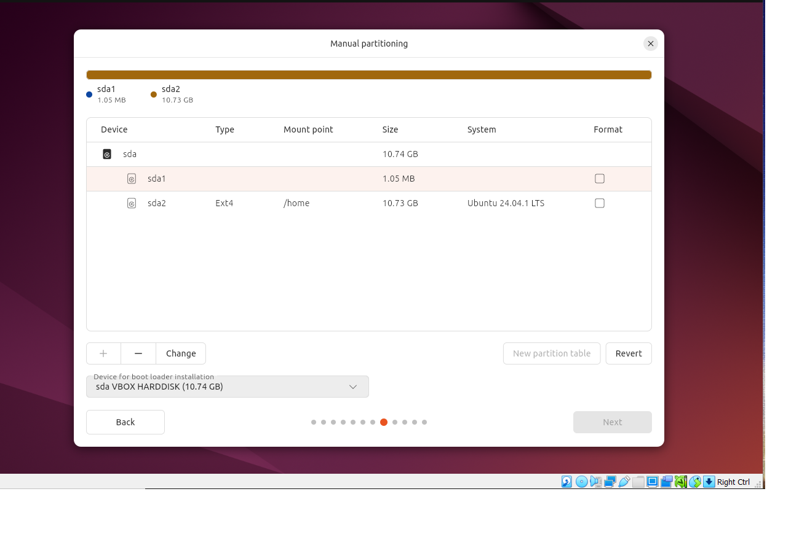
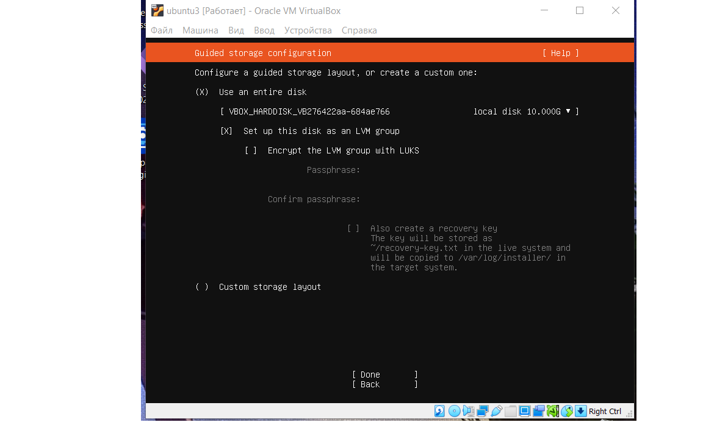
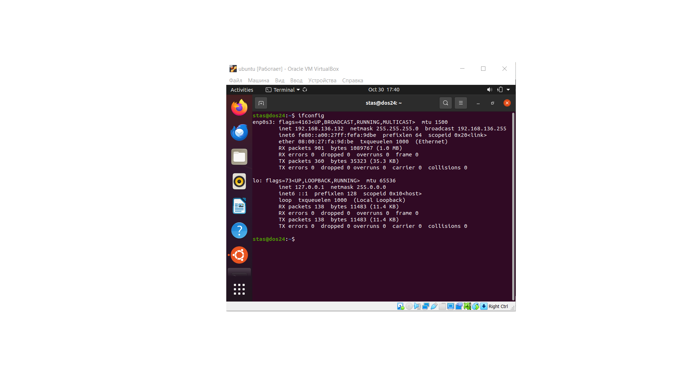

# Solution 
___

### 1.Setting up Ubuntu server 24.04.01
### 2.Download Ubuntu with installation hdd

### 3.Download Ubuntu server

### 4. Update Ubuntu server to Desktop
***sudo apt install ubuntu-desktop***
### Reboot system
***sudo reboot***
