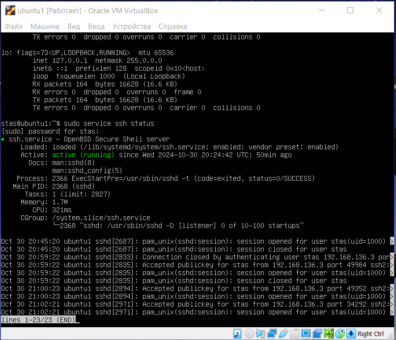
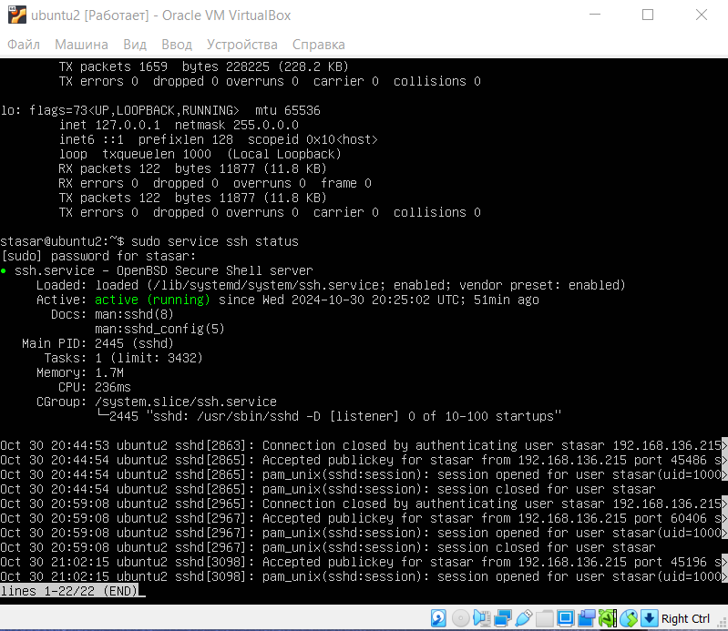
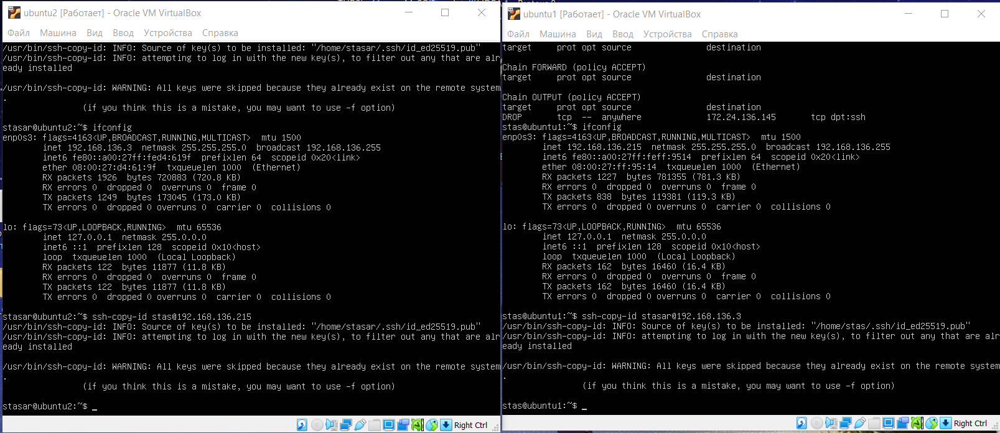
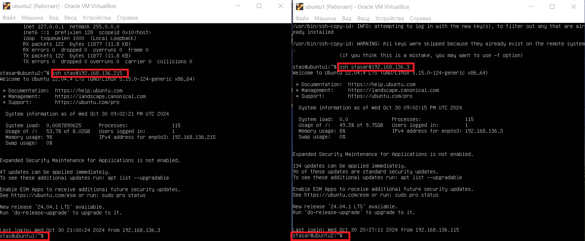
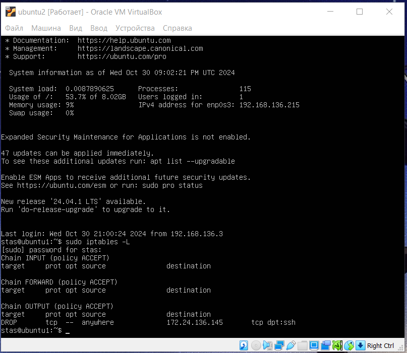
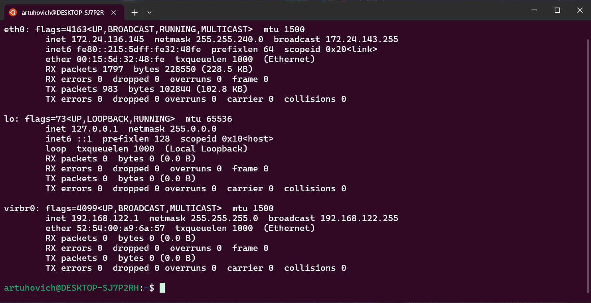

# Solution
___
### 1. Download ISO Ubuntu 24.04
### 2. Create 2 VM (Ubuntu1; Ubuntu2)
___
___
 ***Host => 172.24.136.145***
 ___
 ***Ubuntu1 =>192.168.136.215***
 ___
 ***Ubuntu2 => 192.168.136.3***

## 3.Check ssh on Ubuntu1 and Ubuntu2 
### Ubuntu1

___
## Ubuntu2

___
## 4.Keys
***ssh-keygen -t ed25519***

___
>ssh-copy-id stas@192.168.136.215

>ssh-copy-id stasar@192.168.136.3
___
## 5.Connect VM1 with VM2 via ssh

___
## 6.Prohibit VM2 from entering the main system
***sudo iptables -A OUTPUT -p tcp --dport ssh -d 172.24.136.145 -j DROP***
___

