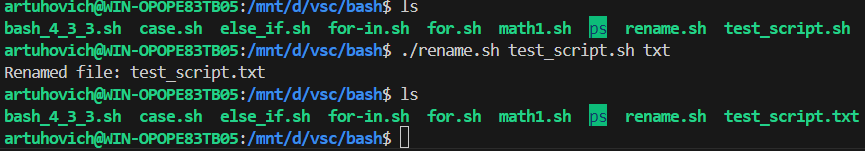
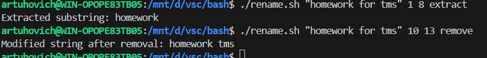

# Задание 
1. Установить MongoDB. *создать таблицу data; создать пользователя manager, у которого будет доступ только на чтение этой таблицы.
2. Ознакомиться с нижеуказанной статьей по теме «Bash» https://habr.com/ru/post/52871/
3. Написать Bash-скрипт в соответствии с требованиями: Содержание скрипта: замена существующего расширения в имени файла на заданное. Исходное имя файла и новое расширение передаются скрипту в качестве параметров. Основное средство: нестандартное раскрытие переменных. Усложнение: предусмотреть штатную реакцию на отсутствие расширения в исходном имени файла.
4. Написать Bash-скрипт в соответствии с требованиями: Содержание скрипта: выделение из исходной строки подстроки с границами, заданными порядковыми номерами символов в исходной строке. Усложнение: предусмотреть возможность не выделения, а удаления подстроки.Основные средства: команда cut, переменные оболочки
___


# Решение 
## 1. MongoDB

```

# Импортировать ключ

wget -qO - https://www.mongodb.org/static/pgp/server-6.0.asc | sudo apt-key add -

#Добавить репозиторий MongoDB в sources.list.d: 

echo "deb [ arch=amd64,arm64 ] https://repo.mongodb.org/apt/ubuntu $(lsb_release -cs)/mongodb-org/6.0 multiverse" | sudo tee /etc/apt/sources.list.d/mongodb-org-6.0.list

# Обновление пакетов

sudo apt update

# Установка MongoDB

sudo apt install -y mongodb-org

# Включаем MongoDB

sudo systemctl enable mongod

# Проверяем статус

sudo systemctl status mongod

# Подключаем интерфейс mongodb

mongosh 
```
## Создание пользователя и таблицы 

```
#создать пользователя
db.createUser(
  {
    user: "manager",
    pwd: "1111",
    roles: [ { role: "read", db: "manager_db" } ]
  }
)

use manager_db

#создание таблицы

db.createCollection("data"); 
```


## 2. Bash-script_1

Создаю файл - *test_script_sh*

<!-- Скрипт лежит в TASK3.sh -->

Данный скрипт принимает указанный файл с его расширением => Записывается новое(желаемое) расширение этого файла => Происходит перезапись расширения файла на новое.

### Запуск
 ` ./rename.sh test_script.sh txt `

 

 ## 3. Bash-script_2

Создаю файл - rename.sh

<!-- Скрипт лежит в TASK4.sh -->

После запуска скрипта и ввода "текста" удаляет элементы по заданным позициям в строке.

### Запуск 
```
 ./rename.sh "homework for tms" 1 8 extract
```
```
 ./rename.sh "homework for tms" 10 13 remove
```



