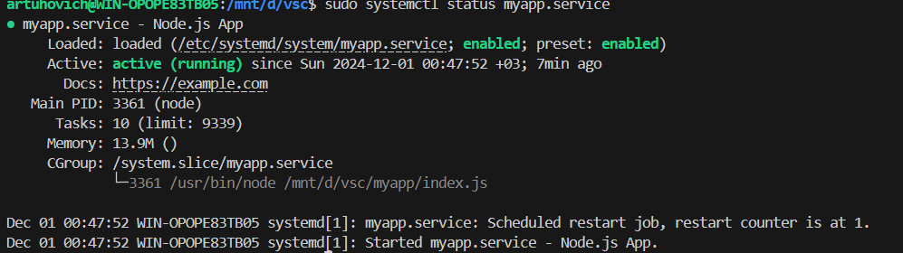
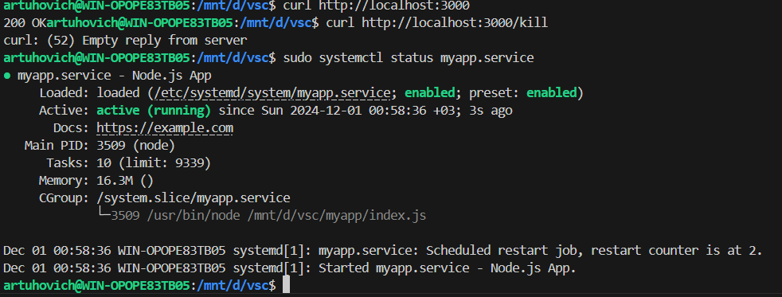

# Задание 
1. Добавить в cron скрипт/команду,которая будет очищать кэш apt (кэшируемые пакеты, пакеты,которые не могут быть загружены) раз в месяц в 16 часов. ** запустить демон nodejs-приложения через systemd. Запуск демона приложения через systemd
   
# Решение 

### 1.Cron скрипт.

1.1. Устанавливаем cron
``` 
sudo apt install cron
```
1.2. Запускаем его
```
sudo systemctl enable cron
```
1.3. Открываем cron для редактирования
```
crontab -e
```

1.4. Переходим в nano
```
sudo nano /etc/crontab
```
1.5. Создаем правило
```
0 16 1 * * sudo apt-get clean  
```


### 2. Запуск демона node.js через systemd.

```
sudo apt install nodejs
sudo apt install npm
```
***Создаём конфиг systemd***
```
sudo nano /etc/systemd/system/myapp.service
```
***Добавляем функционал конфига***
```
[Service]
Environment=MYAPP_PORT=3000
ExecStart=/usr/bin/node /mnt/d/vsc/myapp/index.js
```
/usr/bin/node  >> путь к установленному node.js

/mnt/d/vsc/myapp/index.js >> путь к приложению, которое будет запускать

Сохраняем добавленный функционал и выходим ( ctrl + o => ctrl x), перезапускаем демона и включаем его.
```
systemctl daemon-reload
systemctl enable myapp.service
```
Проверяем активно ли приложение:
```
sudo systemctl status myapp.service
```


### Теперь можем попробовать вызвать приложение, прописать kill и посмотреть восстановится ли оно.
```
curl http://localhost:3000
curl http://localhost:3000/kill
sudo systemctl status myapp.service
```



### Логирование

