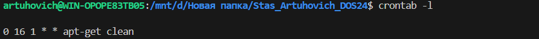

# Задание 
1. Добавить в cron скрипт/команду,которая будет очищать кэш apt (кэшируемые пакеты, пакеты,которые не могут быть загружены) раз в месяц в 16 часов. ** запустить демон nodejs-приложения через systemd. Запуск демона приложения через systemd
   
# Решение 

### 1.Cron скрипт.

1.1. Устанавливаем cron
``` 
sudo apt install cron
```
1.2. Запускаем его
```
sudo systemctl enable cron
```
1.3. Открываем cron для редактирования
```
crontab -e
```

1.4. Переходим в nano
```
sudo nano /etc/crontab
```
1.5. Создаем правило
```
0 16 1 * * sudo apt-get clean  
```


### 2. Запуск демона node.js через systemd.


