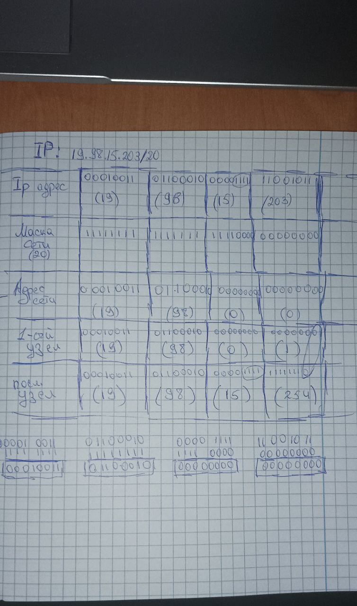
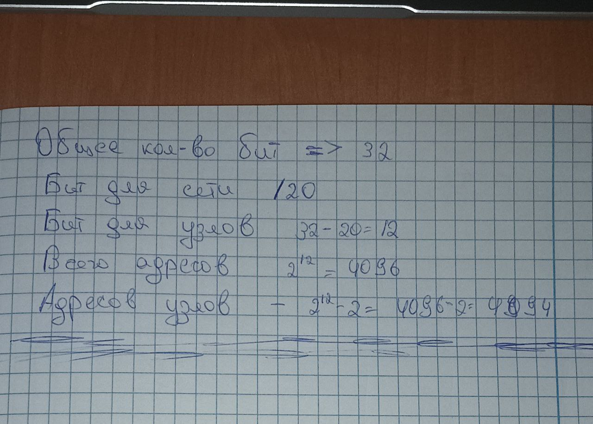
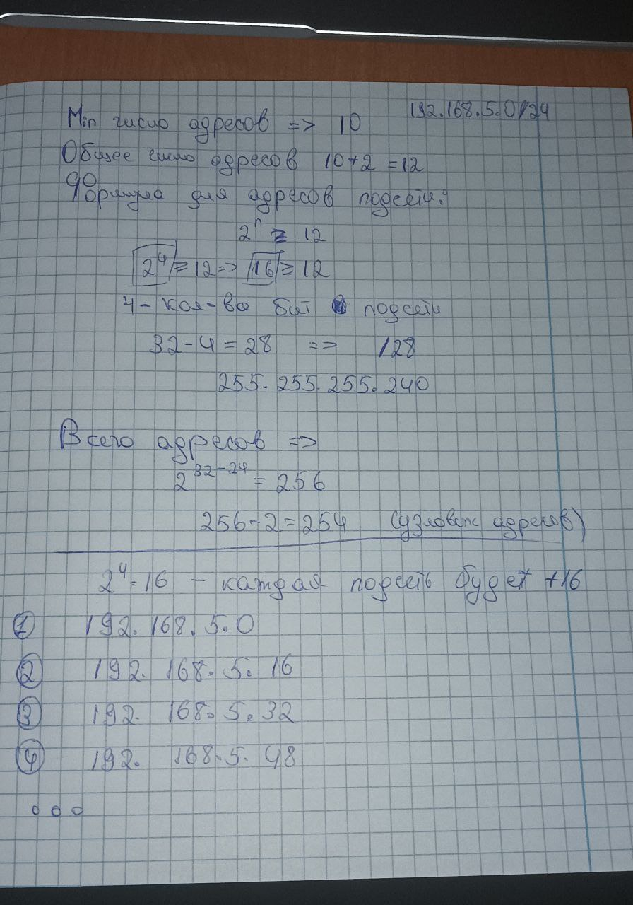

# Задание
1. Зная IPv4-адрес, а также исходную и маску подсети, определить следующие параметры. • Сетевой адрес этой подсети • Широковещательный адрес этой подсети • Диапазон адресов узлов этой подсети • Количество созданных подсетей • Количество узлов в подсети

    `19.98.15.203/20 `

2. Имеется сеть 192.168.5.0/24, разбить на подсети с не менее чем 10 доступными адресами.
___
# Решение
 ## 1.
| Title    | Answer    | Binary    |
|----------|-----------|-----------|
| IP адрес | 19.98.15.203/20 | 00010011.01100010.00001111.11001011
| Маска | 255.255.240.0 | 11111111.11111111.11110000.00000000
| Broadcast | 19.98.15.255 | 00010011.01100010.00001111.11111111
| Сеть | 19.98.0.0 | 00010011.01100010.00000000.00000000
| Минимальный IP | 19.98.0.1 | 00010011.01100010.00000000.00000001
| Максимальный IP | 19.98.15.254 | 00010011.01100010.00001111.11111110
| Кол-во хостов | 2^(32-20)=2^12-2=4094 |
| Класс подсети | class A |

## 2.
 `192.168.5.0/24`

 

