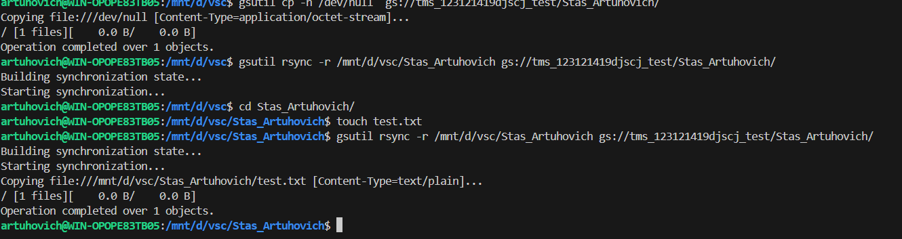

# Задание 
1. Сделать синхронизацию с облачных хранилищем (S3, GCP Storage) c указанием NAME_SURNAME в имени папки
2. FDISK + LVM
3. *Синхронизировать между собой две папки на двух разных вм-ках
4. *Синхронизировать папки на двух вмках и ещё на GCP
___
ссылки на GCP bucket
https://console.cloud.google.com/storage/browser/tms_123121419djscj_test
___

# Выполнение 

### Установка google cloud sdk
```bash
sudo apt update
sudo apt install google-cloud-sdk
```

### Использование gsutil rsync

 1.Создание папки в бакете 
 ``` bash
 gsutil cp -n /dev/null/ gs://tms_123121419djscj_test/Stas_Artuhovich
 ```
 2. Копирование в бакет
```bash
gsutil rsync -r /mnt/d/vsc/Stas_Artuhovich gs://tms_123121419djscj_test/Stas_Artuhovich/
```
3. Создал в папке Stas_Artuhovich файл test.txt и закинул его на cloud




