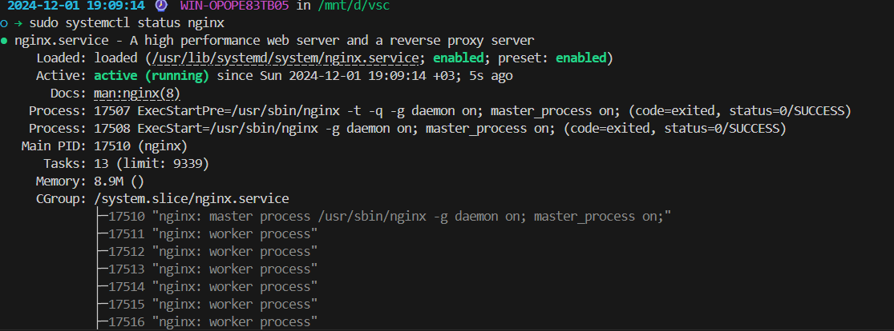
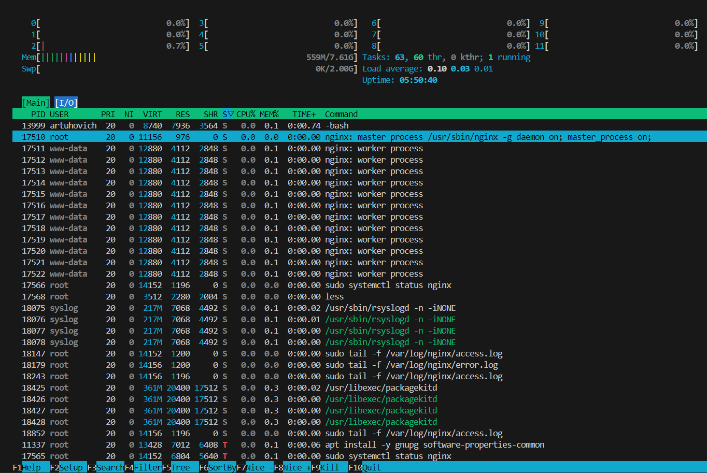
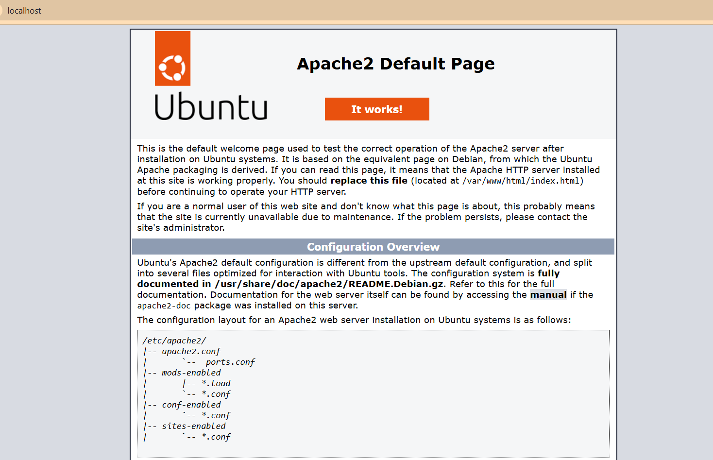
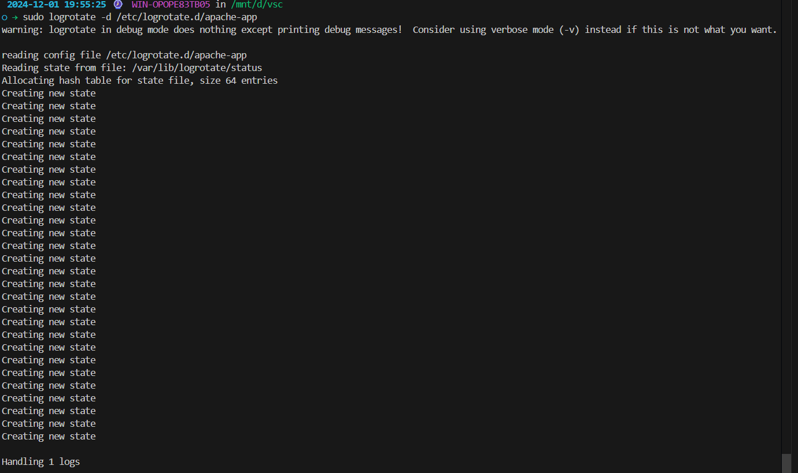

# Задание 
### Цель: освоить принципы работы текстового редактора Vim. Ознакомиться с процессом логирования в Linux. Научиться определять уровень загрузки системы.
##  1. Задание 1: cоздание нового файла с использованием vim

 - 1.1 Создайте каталог с именем practice.

 - 1.2 Перейдите во вновь созданный каталог.

- 1.3 Вызовите vim и создайте файл memo (% vim memo).

- 1.4 Нажмите клавишу i и вводите следующий текст. @REM AUTOEXEC.BAT DTK 386/40 ECHO OFF Path c:\dos;c:\stacker;c:\Util;c:\NC;C:\MOUSE SET PROMPT=$P$G SET TMP=C:\TEMP LH C:\UTIL\RKEGA goto %config% :student1 C:\DOS\SMARTDRV.EXE C+ 2048 1024 goto nc :student2 APPEND E:\tc\bgi :teacher PATH %path%E:\windows;e:\tc;e:\tc\bin;e:\foxpro; goto win :ONC PATH %path%G:\pctcp; SET TZ=GMT goto nc :nc nc.exe goto end win.com :end

- 1.5 Нажмите клавишу для перехода в командный режим после завершения ввода текста.

- 1.6 Нажмите : (двоеточие) для перехода в режим последней строки и внизу вашего экрана появится приглашение в виде двоеточия.

- 1.7 Нажмите w(записать) и q(выйти), а затем нажмите клавишу для сохранения вашего текста и завершения работы.
  
## 2. Задание 2: Редактирование существующего файла
- 2.1 Вызовите vim на редактирование файла memo (% vim ~/practice/ memo).
  
- 2.2 Установите курсор на начало слова DTK в первой строке.
  
- 2.3 Перейдите в режим вставки и наберите 1-203; теперь текст будет выглядеть так: @ REM AUTOEXEC.BAT 1-203 DTK 386/40 Нажмите , чтобы вернуться в командный режим.
  
- 2.4 Установите курсор на четвертую строку и сотрите слово C:\MOUSE.
  
- 2.5 Перейдите в режим вставки и наберите следующий текст: С:\GMOUSE ; нажмите , чтобы вернуться в командный режим.
  
- 2.6 Установите курсор на последней строке файла. Вставьте строку, содержащую следующий текст:extention 287
  
- 2.7 Замените словоextentionнаx.
  
- 2.8 Удалите последнюю строку.
  
- 2.9 Введите команду отмены изменений для отмены последней команды.
  
- 2.10 Установите курсор на первую строку (строка 5), вставьте перед ним пустую строку и введите следующий текст: @REM 22 apr. 1999 Оставьте пустую строку между новым разделом и следующим за ним. Нажмите , чтобы перейти в командный режим.
  
- 2.11 Введите символ : (двоеточие) для перехода в режим последней строки. Запишите произведенные изменения на диск и выйдите из vim.
  
## 3. Задание 3: 
- 3.1 Вернитесь в ваш домашний каталог.

- 3.2 Скопируйте файл testcase.c(предварительно осуществив его поиск) в директории~/practice и вызовите vim для редактирования файла.

- 3.3 Перейдите в каталог~/practice и вызовите vim для редактирования файла testcase.c

- 3.4 Включите отображение номеров строк. Сколько строк в данном файле?
- 3.5 Вернитесь в начало файла.

- 3.6 Найдите слово WORD и замените его на IGNORE.

- 3.7 Найдите слово Reset и замените его на set.

- 3.8 Найдите слово input и замените его на output.

- 3.9 Вставьте строку, заполненную вопросительными знаками <?> под строкой :state = WORD

- 3.10 Скопируйте строки с 16 по 29 в файл printwords.c

- 3.11 Перейдите в конец файла и удалите две последние строки.

- 3.12 Вернитесь в начало файла и перенесите фрагмент текста, начинающийся словами /*Manifests ..., в конец файла.

- 3.13 Запишите произведенные изменения на диск в файл testvim.c и выйдите из редактора.

## Задание 4: 

- 4.1 Установить утилиту nginx, посмотреть ее логи и также уровень нагрузки на ОС. Просмотрите логи действий пользователей системы. 

<ins>***__Опционально :__***

- 4.2 * Установите веб-сервер Apache 2.

- 4.3 * Установите утилиту logrotate, которая помещает access.log и error.
log веб-сервера Apache в /var/log/app/. В системе он работает как пользователь и группа www-data

## ***Задание 1***

Ввести текст из п. ***<ins>1.4.***
(см TASK1.sh)

1.1. Открыть файл
```
vim ~/practice/memo
```
1.2. Редакция текста
```
o - вставить строку снизу
O - вставить строку сверху
x - удалить символ
dd - удалить строку
u - отменить действие
```
```
:wq
```

## ***Задание 2***
Редактирование существующего файла:

2.1. Создать файл
```bash
vim memo
```
2.2. Режим ввода
```
i
```
2.3. Выход с сохранением
```
ESC 
:wq
```

## ***Задание 3***

## ***Задание 4***

 ### 4.1. Установка nginx
 
 ```
 # update
 sudo apt update

 # nginx
 sudo apt install nginx -y

 # status
 sudo systemctl status nginx
```


4.1.1.  Логи nginx
```
sudo tail -f /var/log/nginx/access.log
sudo tail -f /var/log/nginx/error.log
```


### 4.2. 

4.2.1. Установка apache2
```
sudo apt update
sudo apt install apache2 -y
```
```
sudo systemctl start apache2
sudo systemctl enable apache2
sudo systemctl status apache2
```
4.2.2. На основной системе win11 зашёл в браузер и ввел =>
```
http://localhost
```


### 4.3

4.3.1. Установка logrotate
```
sudo apt install -y logrotate
```
```
sudo mkdir -p /mnt/d/vsc/logs.apache2
sudo chown www-data:www-data /mnt/d/vsc/logs_apache2
```
4.3.2. Настройка Apache2 для записи логов в новый каталог.
```
sudo nano /etc/apache2/sites-available/000-default.conf
```
4.3.3. Изменение строк
```
ErrorLog /mnt/d/vsc/logs_apache2/error.log
CustomLog /mnt/d/vsc_logs_apache2/access.log combined
```
4.3.4. Перезапуск apache2
```
sudo systemctl restart apache2
```
4.3.5. Настройка logrotate для новых логов.
```
sudo nano /etc/logrotate.d/apache-app
```
```
/mnt/d/vsc/logs_apache2/*.log {
    daily
    missingok
    rotate 14
    compress
    delaycompress
    notifempty
    create 640 www-data www-data
    sharedscripts
    postrotate
        systemctl reload apache2 > /dev/null 2>/dev/null || true
    endscript
}
```
4.3.6. Тест logrotate
```
sudo logrotate -d /etc/logrotate.d/apache-app
```



